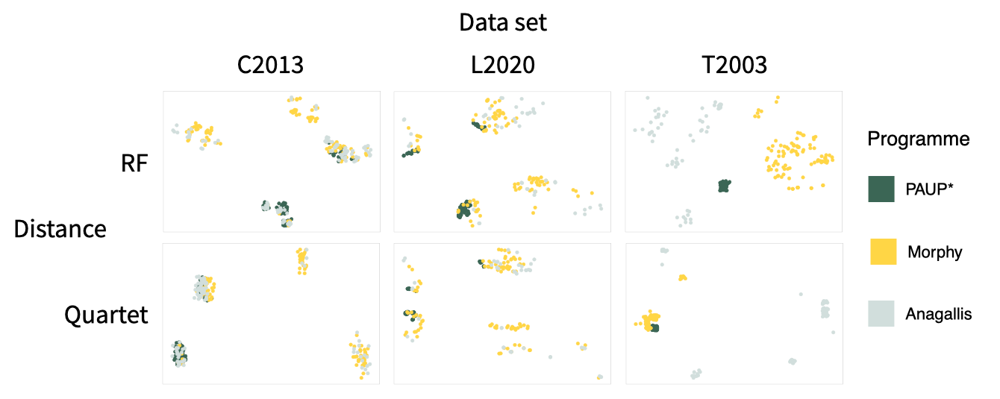

# Morphological Character Hierarchies

Morphological characters often exist in hierarchies whereby the state of one character controls the state of a subset of characters. This violates the assumptions of phylogenetic analysis that characters are independent and applicable to all taxa. As these violations are known to have the possibility of misleading phylogenetic analyses, two programmes, Morphy and Anagallis, have been developed to address the issue of inapplicability by accounting for the violations. The phylogenies produced by Morphy and Anagallis were compared to those of PAUP*, a traditional programme of phylogenetic analysis, to investigate the merit of the new programmes.

This analysis formed my final year project at Imperial College London under the supervision of Dr. Martin Brazeau with additional inputs from Thomas Guillerme, at the University of Sheffield.

### Repository Description
In this repository, you can find all the code and data used for the project and this brief description should make it easier to navigate.

The files present in the "Data" folder are named after the lead author(s) whose morphological data sets I analysed with PAUP*, Morphy and Anagallis.

Within each of the study folders, you can find character matrices, character lists, files containing the trees found by each programme and the R scripts used to analyse those trees.
Files relating to PAUP* are marked "Paup", Morphy marked "Morphy" and Anagallis marked "Ana".
Character matrices can be identified by the extensions .nex and .tnt while tree lists contain "tree" in their filenames and have the extension .tre or .nex (files labelled "contree" describe the consensus tree generated by one of the programmes).

Data obtained from tree comparison analyses are pooled into .csv (and .numbers) files in the "Data" folder and the R scripts in this folder were used to carry out analyses across the data sets.

### Summary of Results
#### Treating inapplicable data as inapplicable affects the topology of optimal trees

* the x-axis designates the study while the y-axis describes the distances between trees of a pair of programmes
* dots and lines represent the median distance and IQR, respectively
* the greater the distance, the more different tree topologies are between programmes

#### Morphy and Anagallis often sample regions of the tree space not sampled by PAUP*

* each plot is a sections of the tree space
* each dot represents an optimal tree found by one of the programmes
* topological differences seem to be driven by the programmes sampling different regions

#### When inapplicable data are taken into account, consensus trees tend to collapse

